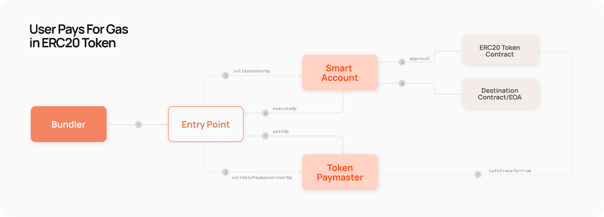

# Overview

The Biconomy SDK is an Account Abstraction toolkit that enables the simplest UX on your dApp or wallet. Built on top of the ERC 4337 solution for Account Abstraction, we offer a full-stack solution for tapping into the power of our Smart Accounts Platform, Paymasters, and Bundlers. 

## Smart Accounts Platform

The Biconomy Smart Account is an ERC 4337-compliant solution that works with any Paymaster and Bundler service. Smart Accounts are governed by code instead of ECDSA, which allows for other types of signature algorithms to be used with the Smart Account. Additionally, the smart accounts package allows you to quickly and easily build and execute User Operations or userOps. These are pseudo-transaction objects that eventually execute as a transaction on the EVM.  

The Biconomy Smart Accounts are signer agnostic, which allows you to use any authorization package of your choice as long as you can pass a signer to our SDK upon the creation of a Smart Account. Check out different ways you can create a Biconomy Smart Account [here](/docs/category/creating-accounts).

Smart Accounts are further enhanced by validation modules that allow you to execute arbitrary logic before validating a userOp. This allows you, as a developer, to build modules that allow for session keys, multi-chain validation modules, pass keys, and more. 

If you want to start diving into Smart Accounts you can do so [here](/docs/category/smart-accounts). If you know all about Smart Accounts and prefer to start working with modules, start learning about them [here](/docs/category/modules) or follow this step-by-step [tutorial](/docs/category/session-keys-tutorial) on how to build a dApp that utilizes session key modules. 

## Paymaster

Biconomy offers a Paymaster service designed with one of the best developer experiences in mind. Simply use one URL and switch modes between our sponsorship paymaster and our Token Paymaster. 

### Sponsorship Paymaster

If the mode you choose in the request to the Paymaster URL is the sponsored mode, your users will benefit from gasless transactions, and you remove the friction point of needed native tokens to pay for gas on transactions. Learn how to set up your paymaster [here](/docs/dashboard/paymaster).

### Token Paymaster

Switching the mode of your Paymster to ERC20 allows you to unlock an experience where users can pay gas in any of our supported ERC20 tokens on different networks. Check out the latest supported tokens [here](/docs/supportedchains/supportedTokens).

Learn how to utilize either of these Paymasters by checking out our How To Guide on [Executing transactions](/docs/category/executing-transactions)

## Bundler

The Bundler is a service that tracks userOps that exist in an alternative mem pool and as the name suggests, bundles them together to send to an Entry Point Contract for eventual execution onchain. This is the final piece of the flow where after constructing your userOp and then potentially signing it with data from a paymaster, you send the userOp on chain to be handled and executed as a transaction on the EVM. You can start using our Bundlers right now in your dApps; each of our [tutorials](/docs/category/tutorials) will walk you through how to use them in different scenarios.

