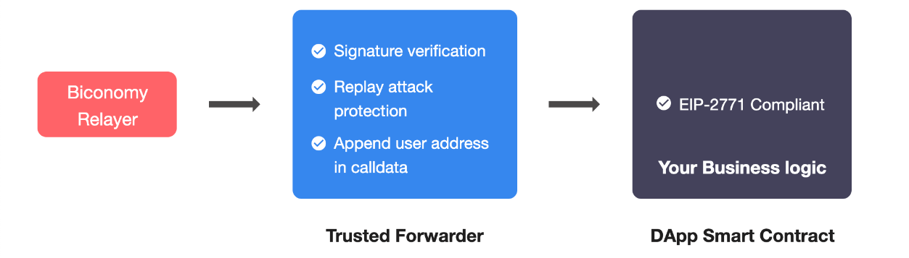

# Overview

> Secure Protocol For Native Meta Transactions.

[EIP-2771](https://eips.ethereum.org/EIPS/eip-2771) approach is a standardised way of sending Gasless transactions. Meta transaction aware recipient contracts only rely on a small trusted forwarder contract for their security. This contract verifies the signature and nonce of the original sender. Biconomy provides a default implementation of Forwarder which verifies the signature and forwards the call to the recipient smart contract.



## Gasless Transactions Using EIP2771 Approach

In order to send gasless transactions in your dApp via Biconomy using standard meta transaction approach, the following two integration steps will be required

1. Smart Contract Changes (Making Contract Meta Transaction Compliant)
2. Client Side Changes

## Smart Contract Changes

With adherence to [EIP-2771](https://eips.ethereum.org/EIPS/eip-2771) to enable native meta transactions in your contract, you can just inherit a simple contract [ERC2771Recipient.sol](https://github.com/opengsn/gsn/blob/master/packages/contracts/src/ERC2771Recipient.sol) and set the trusted forwarder address.

After inheriting **above** smart contract, you need to use **_msgSender()** method wherever you use msg.sender

You can also use OpenZeppelin's [ERC2771Context.sol](https://github.com/OpenZeppelin/openzeppelin-contracts/blob/master/contracts/metatx/ERC2771Context.sol) as a base contract which allows you to set the trusted forwarder in the constructor and provides msgSender(). Note if any of your contracts have Context.sol as base then you need to override from both and use ERC2771Context.msgSender()

:::info
 List of trusted forwarder addresses* per network can be found here 
https://docs.biconomy.io/smart-contracts/addresses 

*constructor argument is trusted forwarder
:::

## Template Contract

```solidity
import "@opengsn/contracts/src/ERC2771Recipient.sol";
// import "@openzeppelin/contracts/metatx/ERC2771Context.sol";

// OR MyContract is ERC2771Context
contract MyContract is ERC2771Recipient {

    /** 
     * Set the trustedForwarder address either in constructor or 
     * in other init function in your contract
     */ 
// OR constructor(address _trustedForwarder) public ERC2771Context(_trustedForwarder)
    constructor(address _trustedForwarder) public {
        trustedForwarder = _trustedForwarder;
    }
    
    ...
    
    /**
     * OPTIONAL
     * You should add one setTrustedForwarder(address _trustedForwarder)
     * method with onlyOwner modifier so you can change the trusted
     * forwarder address to switch to some other meta transaction protocol
     * if any better protocol comes tomorrow or the current one is upgraded.
     */
    
    /** 
     * Override this function.
     * This version is to keep track of BaseRelayRecipient you are using
     * in your contract. 
     */
    function versionRecipient() external view override returns (string memory) {
        return "1";
    }
}
```

### Importance of setTrustedForwarder() method

Do add setTrustedForwarder(address _forwarder) method in your smart contract to change the address in future in case new implementations are introduced, as it's not a part of EIP-2771. You can add onlyOwner modifier to this function.

:::info
TrustedForwarder is not expected to change anytime in the future until new signature scheme or a better replay protection mechanism is introduced. But in that case new TrustedForwarder will be deployed and current implementation will continue to be supported.

If you have security concerns about adding setTrustedForwarder method with onlyOwner modifier, you can also hardcode the TrustedForwarder address in your smart contract.
:::

That's it!! You have now enabled native meta transaction support in your smart contract.

### Use _msgSender(), not msg.sender

The Trusted Forwarder is responsible for signature verification and replay protection and forwards the transaction to your smart contract by appending the user address at the end of call data. The _msgSender() method in your smart contract (inherited by BaseRelayRecipient) does the rest by returning the correct address for any context. **Use _msgSender() wherever you use msg.sender.**

## Why and when should you use this approach?

Your contract can be easily modified to securely accept meta-transactions whilst giving you the flexibility to change the meta transaction approach your dApp uses if your needs change. In the next section, we'll see the steps to start using EIP-2771 enabled gasless transactions.
Client Side Changes
The next step is Biconomy's integration on the client side. This can either be done via SDK integration or API integration. For both cases, first, you need to register your dApp on [Biconomy Dashboard](https://dashboard.biconomy.io/) and get your API Key.
Check out the next section on how to register your dApp on the dashboard.
