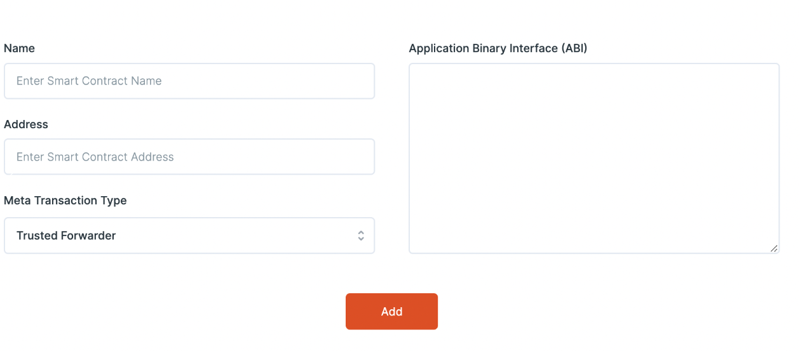
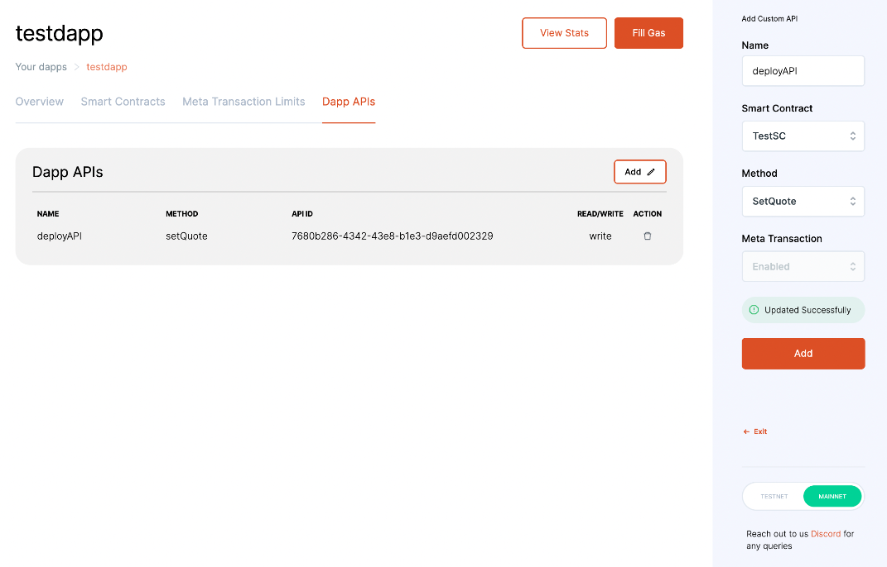

# 1. Register Artifacts on the Dashboard

> Changes to be done on the dashboard to enable EIP-2771 gasless transactions.

## Register Smart Contracts

::info
[Checkout this section](https://docs-gasless.biconomy.io/guides/biconomy-dashboard#register-a-dapp) if you don't know how to register a dApp on the dashboard.
:::

After having your dApp registered, on the “Add Smart Contract” page, enter the contract name, address and ABI, then set the Meta Transaction Type to **“Trusted Forwarder”** and click “Add”.

The ABI is the description of the contract interface. It contains no code and cannot be run by itself. Example of an ABI of a test contract:

// !TODO

<!-- <Tabs
  defaultValue="test"
  values={[
    {label: 'TestContract.sol', value: 'test'},
    {label: 'ABI of TestContract.sol', value: 'abi'},
  ]}>

  <TabItem value="test">

  ```solidity
  pragma solidity ^0.5.0;

contract TestContract {
  constructor() public { b = hex"12345678901234567890123456789012"; }
  event Event(uint indexed a, bytes32 b);
  event Event2(uint indexed a, bytes32 b);
  function foo(uint a) public { emit Event(a, b); }
  bytes32 b;
}
  ```

  </TabItem>

  <TabItem value="abi">
  
  ```json
  [
  {
    "type": "event",
    "inputs": [
      {
        "name": "a",
        "type": "uint256",
        "indexed": true
      },
      {
        "name": "b",
        "type": "bytes32",
        "indexed": false
      }
    ],
    "name": "Event"
  },
  {
    "type": "event",
    "inputs": [
      {
        "name": "a",
        "type": "uint256",
        "indexed": true
      },
      {
        "name": "b",
        "type": "bytes32",
        "indexed": false
      }
    ],
    "name": "Event2"
  },
  {
    "type": "function",
    "inputs": [
      {
        "name": "a",
        "type": "uint256"
      }
    ],
    "name": "foo",
    "outputs": []
  }
]
  ```

  </TabItem>
</Tabs> -->



> After this step you need to add your APIs as mentioned in the steps in [Biconomy Dashboard.](https://docs-gasless.biconomy.io/guides/biconomy-dashboard)

:::info
Before using this API and Gasless SDK (EOA)  make sure you have native meta transaction support in your smart contracts i.e., you have **removed** the dependency on the **msg.sender** property from your smart contracts.
:::

## Select Smart Contract Methods

:::info
Checkout [how to add smart contract methods on the dashboard here.](https://docs-gasless.biconomy.io/guides/biconomy-dashboard#add-apis)
:::

After uploading your smart contract, the next step is to select the smart contract method which needs to be called from client side.



After adding the smart contract and methods on the dashboard, the next step is to integrate Biconomy SDK or API in the client side code.
