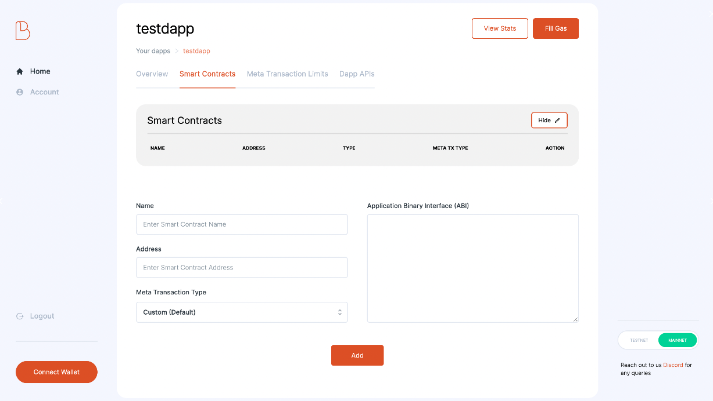
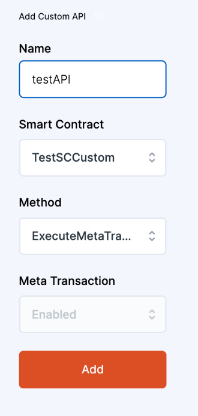

# 1. Register Artifacts on the Dashboard

> Changes to be done on the dashboard for custom gasless transactions.

## Register Smart Contracts

:::info
[Checkout this section](https://docs-gasless.biconomy.io/guides/biconomy-dashboard#register-a-dapp) if you don't know how to register a dApp on the dashboard.
:::

After having your dApp registered, on the “Add Smart Contract” page, enter the contract name, address and ABI, select Meta Transaction Type as **“Custom”** then click “Add”.

The ABI is the description of the contract interface. It contains no code and cannot be run by itself. Example of an ABI of a test contract:

!TODO

## Select Smart Contract Methods

:::info
Checkout [how to add smart contract methods on dashboard here.](https://docs-gasless.biconomy.io/guides/biconomy-dashboard#add-apis)
:::

After uploading your smart contract, the next step is to select the smart contract method which needs to be called from client side. Now here instead of selecting your smart contract methods, you need to select the **ExecuteMetaTransaction** method inherited from Biconomy Contracts because that's the method we'll be calling from the client side.

ExecuteMetaTransaction has functionSignature as a parameter so any method you need to make gasless can be passed as data here. If you have inherited EIP712MetaTransaction specs, the only method you will register is executeMetaTransaction.

:::info
If you have methods in your smart contract that already supports native meta transaction via user signature as parameters or if they do not depend on msg.sender, you can directly select those methods here and call them from the client side. eg. DAI or USDC permit method.
:::

After adding the smart contract and methods on the dashboard, the next step is to integrate Biconomy SDK or API in the client side code.
