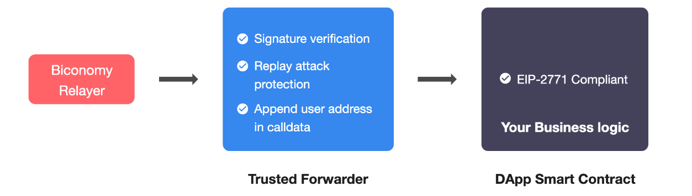

# Overview

> Enable Gasless transactions in your dApp in three easy steps.

Three steps are required to achieve this:

- Making your contract meta-transaction compatible.
- Registering your artifacts on the dashboard.
- Integrate our Gasless SDK (EOA) or use our API in your code.

## I. Making Your Contract Meta Transaction Compliant

There are three ways of making your contract meta transaction compliant.

### [1. Standard EIP 2771 Implementation Approach](https://docs-gasless.biconomy.io/products/enable-gasless-transactions/choose-an-approach-to-enable-gasless/eip-2771)

EIP2771 is the standard way for receiving meta transactions through a Trusted forwarder. It defines a minimal contract-level protocol that a compliant Recipient contract needs to support in order to be capable of accepting a meta transaction through a compliant Forwarder contract.

Instead of integrating meta transaction validation logic directly into your contract - you can inherit a recipient contract that can accept validated calls from a trusted forwarder. The trusted forwarder complies with EIP 2771 and verifies signatures before calling smart contract with the original user address data appended. It makes development easier and gives you the flexibility to change the trusted forwarder address when your needs change.

Read more about [EIP 2771.](https://docs-gasless.biconomy.io/products/enable-gasless-transactions/choose-an-approach-to-enable-gasless/eip-2771)

### [2. Custom Implementation Approach](https://docs-gasless.biconomy.io/products/enable-gasless-transactions/choose-an-approach-to-enable-gasless/custom-implementation)

In certain use cases, it makes sense to use a custom approach. For example, where it is important to eliminate external control, or you need to implement a standard compliant function - such as [EIP 2612 permits.](https://eips.ethereum.org/EIPS/eip-2612)
We provide contracts for you to inherit this functionality in your dApps. Tokens such as Dai and USDC (and their permit functions) can be supported in your dApp, via Biconomy, using the [Custom Implementation](https://docs-gasless.biconomy.io/products/enable-gasless-transactions/choose-an-approach-to-enable-gasless/custom-implementation) approach.

### [3. Smart Contract Wallet Approach](https://docs-gasless.biconomy.io/products/enable-gasless-transactions/choose-an-approach-to-enable-gasless/external-wallet-support)

If your smart contracts can not be changed or updated to support native meta transactions, you can still do meta transactions via the smart contract wallet approach. Here a contract wallet is created for each end user and later all his transactions are routed via his smart contract wallet.

Biconomy supports Gnosis contract wallet integration. Checkout how you can integrate meta transactions via Gnosis smart contract wallet [here.](https://docs-gasless.biconomy.io/products/enable-gasless-transactions/choose-an-approach-to-enable-gasless/external-wallet-support)

:::info
EIP2771 is more standardised approach and it allows you to register the specific methods you need to make gasless. Also it requires minimal code changes on the client side. It also requires you to set trusted forwarder in your smart contract. If you choose this approach you can also use Forward without any changes in your contract later as Forward requires EIP2771 specs.

Custom approach is more use case oriented for example [permit](https://eips.ethereum.org/EIPS/eip-2612) or gasless approvals on tokens which are already inheriting from [EIP712MetaTransaction.sol specs.](https://github.com/bcnmy/metatx-standard/blob/master/src/contracts/EIP712MetaTransaction.sol) It needs more code changes as [EIP712 domain type and domain data](https://eips.ethereum.org/EIPS/eip-712) (responsible for signature verification) is defined in the recipient contract. If required, you can also have control over the message structure that user signs.
:::

## II. Registering Artifacts On The Dashboard

After having your dApp registered on the dashboard, navigate to the 'Add Smart Contract' page, enter the contract name, address and ABI. The details to be entered here will depend on the approach you use to implement meta transaction compliance.

## III. Integrate our Gasless SDK (EOA) Or Use API

Biconomy's Gasless SDK (EOA) is a javascript based implementation that can be easily integrated into your dApp. The SDK can be used on client side code running in a browser or a javascript based dApp running on a backend server. It works alongside your existing Web3 library by acting as a Web3 provider that submits meta transactions to our relayer infrastructure - instead of directly to the network.

You can also directly  use our APIs for sending gasless transactions using Biconomy's infrastructure.

:::info

### Gas Tank Deposits

Every dApp has its own gas tank on each network which ensures that Biconomy relayers have enough gas to pay for the transaction fees and the transactions are relayed smoothly. In order to enable gasless transactions, dApp developers need to deposit chain native tokens in the dApp Gas Tank.  [Learn more about Gas Tank Deposits.](https://docs-gasless.biconomy.io/guides/gas-tank-deposits)
:::

:::info

### Extended Forwarder

The default TrustedForwarder performs signature validation & nonce check before forwarding the transaction. There could be a case when special on chain validations need to be made before forwarding a transaction to the blockchain. We have specialized Forwarders for this called Extended Forwarders. Please reach out to us if you have a special use case.
:::
