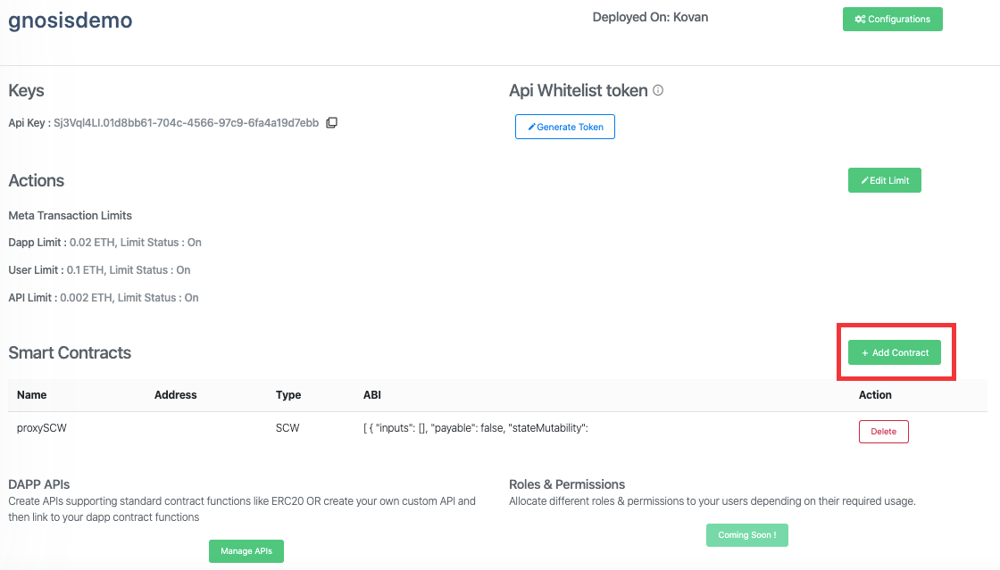

# Gnosis

> Gnosis provides secure management of blockchain assets.

:::info
Skip this section if you don't use Gnosis external smart contract wallet.
:::

## How to register Gnosis Proxy wallets?

- First [Register](https://docs.biconomy.io/biconomy-dashboard#register-account) on the dashboard and create a [DApp](https://docs.biconomy.io/biconomy-dashboard#register-a-dapp). After your Dapp is registered, click on the "Add Contract" button.

- Once open, Go to "Smart Contract Wallet (SCW) Tab" and add the **Name** & **ABI** of your proxy wallet Contract. Click **Add**.

:::info
Your Proxy Contract Wallet should have methods that support native meta transaction and are able to relay the transaction to other contracts.
:::

For this, you don't NEED to register the contract address as it will be dynamic and you can set as a parameter while calling SDK or API.

- After adding the contract, click in "Manage API". Contract Entry will look like as shown below in the screenshot.

- Click on "New API" . Select Smart Contract, Method (for which you want to enable meta transactions), enter the name of your API then click “Add”.

- Your API will not persist in the database at this point of time.
- You can add more than one API. Added APIs will be visible at the bottom. Click on “Save” to persist them in database.
- Native meta-tx check box will be selected by default (As your proxy contract is supposed to have native meta transaction support)
- After Save, the APIs will be listed as shown below. You can Delete or Modify it from "Manage API" section.

## API Whitelisting Auth Token

These tokens are used as authentication token for whitelisting APIs used to whitelist users's smart contract wallet address and destination address of the transaction.

Check out why whitelisting is required [here.](https://docs-gasless.biconomy.io/api/whitelist-api)

:::info
Token can be used only for whitelisting Apis, only if you are using external smart Contract like Gnosis.
:::

- On "View Dapp" section, you can see "Generate Token" Button.

- After clicking it, this will generate the token which you can use to call Whitelist APIs from your Backend.

That's it. Your contract wallet is registered on the Dashboard.

You can checkout the next section on how to enable Network Agnostic Transactions for your end users using Biconomy.
