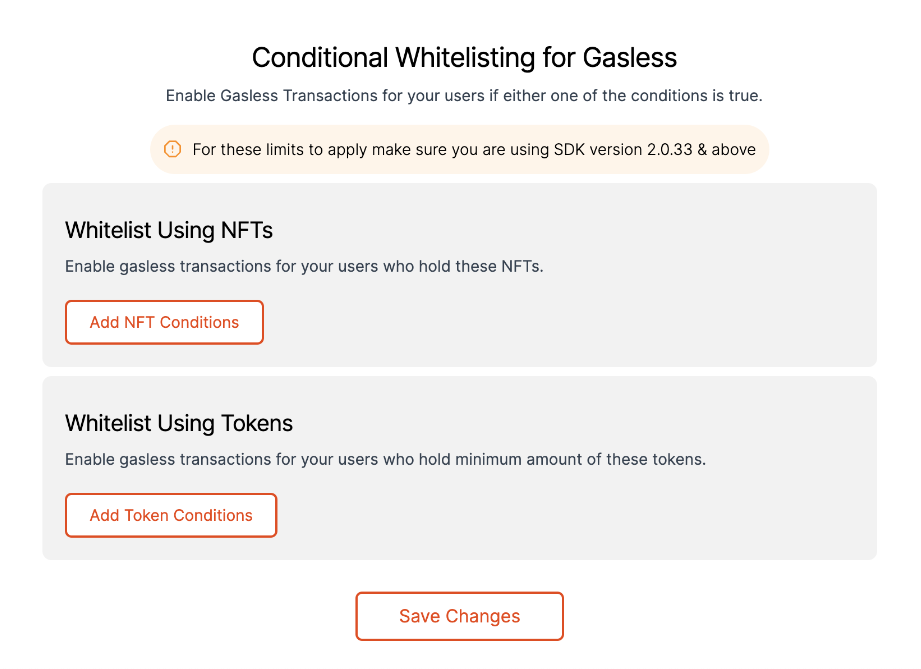
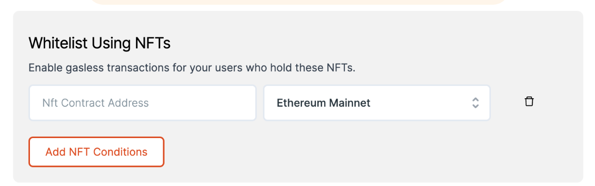
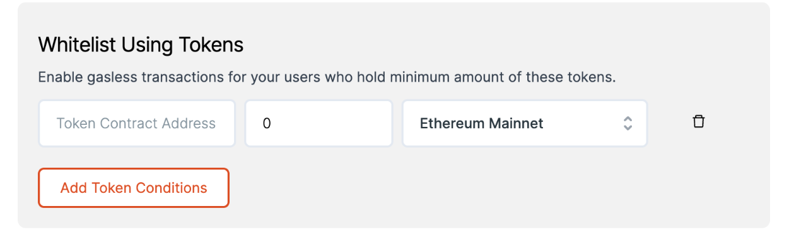

# Conditional Whitelisting

> Enable gasless transactions only for conditions that are favourable to your business.

We understand that businesses might not want to sponsor gas for all transactions belonging to a particular method. For instance, if a dApp has enabled gasless for staking, we understand that it might not be profitable to sponsor gas for staking all amounts. It might only make sense if the amount staked is above a certain X value.

We want to encourage cases wherein the user is incentivised to participate more in the dApp ecosystem & it makes business sense for the dApp to sponsor gas too. For this we now have a conditional gasless feature on our dashboard.

Using the Conditional Gasless feature you can sponsor gas for your users in basis either of the following conditions.

:::info
For conditional whitelisting to apply, make sure you are using SDK version 2.0.33 & above.
:::



### 1. Using NFTs

This functionality helps provide gasless transactions for users who hold certain NFTs. You can provide the Contract Address of your NFT contract & choose the network its on. All users holding NFTs belonging to that particular contract will now be eligible for gasless transactions. For other users, it will fall back to the user paying gas. You can set upto 5 different NFT Contracts for the same. Click on Save Chages for conditions to take effect.



### 2. Using Token Holdings

This functionality helps provide gasless transactions for users who hold minimum amount of certain tokens. You can provide the Token Contract Address, the minimum amount of tokens to be held by the user & choose the network its on. All such token holders will now be eligible for gasless transactions. For other users, it will fall back to the user paying gas. You can set upto 5 different Token Contracts for the same. Click on Save Chages for conditions to take effect.



:::note
Please Note: The implementation is such that if any of these conditions are found to be true, the transaction will be sent in a Gasless way.
:::

## Gasless Webhooks

:::info
Gasless Webhooks are available in Gasless SDK version 2.0.38
:::

A dapp developer can also register custom webhooks, that can be executed and basis on the response a transaction can be executed.
To register webhooks head over to [Dashboard APIs](https://docs-gasless.biconomy.io/api/dashboard-apis#you-can-register-webhooks-post-and-get-api-calls-which-would-be-executed-before-sending-a-transactio) section.

### How to use Webhooks

```js
// One has to pass in webHookAttributes just like gasLimit to an ethers call:
let webHookAttributes = {
    "webHookId": "<Webhook Id received when registering a webhook>", // replace webHookId that one gets from register webhookId
    "webHookData": <Object to be passed in your webhook>,
};

const txHash = await provider.send("eth_sendTransaction", [txParams])
```

Example: https://github.com/bcnmy/mexa-sdk/blob/2b39af4f35490c347175923c2d0260109513d267/src/BiconomyWalletClient.js#L135


